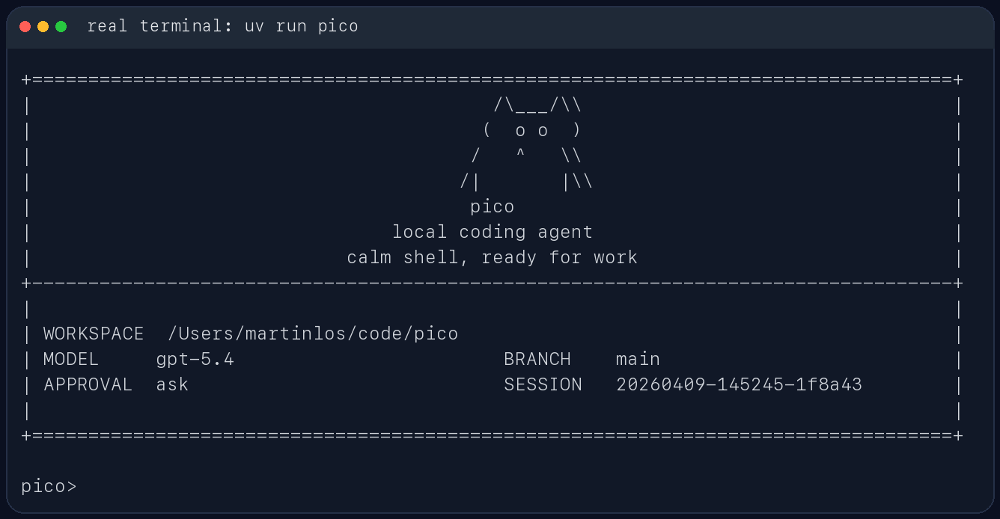

# EduCoder

`EduCoder` 是一个面向代码仓库的轻量本地 coding agent。它直接跑在终端里，先看当前工作区，再用一组受约束的工具去读文件、改文件、跑命令，并把会话状态保存在本地 `.educoder/` 目录里。

它更像一个能在仓库里持续工作的命令行助手，不是纯聊天窗口。你可以拿它做代码排查、测试修复、仓库分析，或者让它在当前项目里执行一次性的工程任务。

## 适合做什么

- 在本地仓库里排查测试失败
- 读取当前代码结构并给出修改建议
- 基于现有文件做小步迭代，而不是脱离仓库空想
- 在会话中保留上下文，支持继续上一次工作

## 主要特性

- 包名是 `educoder`
- CLI 命令是 `educoder`
- 模块入口是 `python -m educoder`
- 会话保存在 `.educoder/sessions/`
- 每次运行的工件保存在 `.educoder/runs/<run_id>/`
- 支持三类模型后端：
  - Ollama
  - OpenAI 兼容 Responses API
  - Anthropic 兼容 Messages API
- 三种运行模式（`--mode`）：
  - `developer`（默认）：完整工具访问，面向开发者
  - `student`：苏格拉底式教学，禁用文件写入和 shell，提供 Docker 沙箱代码执行
  - `teacher`：从学生交互数据生成分析报告，不进入 REPL

## 使用截图

CLI 帮助信息：


启动界面：



REPL 内置命令与会话路径：


## 安装

需要 Python 3.10+。

如果你用 `uv`，直接安装依赖：

```bash
uv sync
```

如果你已经在自己的 Python 环境里工作，也可以直接装成可编辑模式：

```bash
pip install -e .
```

如果需要学生或教师模式的可选依赖：

```bash
pip install -e ".[student]"   # Docker SDK（沙箱执行）
pip install -e ".[teacher]"   # Rich（终端分析报告）
pip install -e ".[edu]"       # 两个都装
```

## 快速开始

在当前仓库里启动交互模式：

```bash
uv run educoder
```

指定另一个工作目录：

```bash
uv run educoder --cwd /path/to/repo
```

直接跑一次性任务：

```bash
uv run educoder "inspect the test failures and propose a fix"
```

如果当前环境已经安装过包，也可以直接这样启动：

```bash
python -m educoder
```

## 模型后端

### Ollama

```bash
ollama serve
ollama pull qwen3.5:4b
uv run educoder --provider ollama --model qwen3.5:4b
```

### OpenAI 兼容接口

```bash
export OPENAI_API_BASE="https://your-api.example/v1"
export OPENAI_API_KEY="your-api-key"
export OPENAI_MODEL="gpt-5.4"
uv run educoder --provider openai
```

### Anthropic 兼容接口

```bash
export ANTHROPIC_API_BASE="https://www.right.codes/claude/v1"
export ANTHROPIC_API_KEY="your-api-key"
export ANTHROPIC_MODEL="claude-sonnet-4-6"
uv run educoder --provider anthropic
```

如果你的服务端对多个兼容接口复用了同一套密钥，`EduCoder` 也支持从 `ANTHROPIC_API_KEY` 回退到 `RIGHT_CODES_API_KEY` 或 `OPENAI_API_KEY`。

## 教育模式

EduCoder 内置了面向编程教学的三种模式，通过 `--mode` 切换。

### 学生模式（student）

学生模式下，EduCoder 会扮演苏格拉底式导师：不给完整代码答案，而是通过引导性问题帮助学生自己思考。学生的代码可以在 Docker 沙箱里安全执行，不会影响宿主环境。

```bash
uv run educoder --mode student
```

学生模式的特点：

- **工具限制**：禁用 `write_file`、`patch_file`、`run_shell`，防止学生直接修改工作区文件
- **沙箱执行**：提供 `run_sandbox_code` 工具，在 Docker 容器中运行 Python 代码（`python:3.13-alpine`，无网络，100MB 内存限制，5 秒超时）
- **苏格拉底式提示**：系统提示词要求 agent 不输出完整代码，而是给提示和引导问题
- **隐私保护**：自动过滤学生输入中的邮箱和电话号码
- **交互记录**：所有交互自动存入 `.educoder/traces.db`（SQLite），供教师模式分析

> 需要安装 Docker 并运行 `pip install -e ".[student]"` 才能使用沙箱功能。

### 教师模式（teacher）

教师模式读取学生交互数据，生成分析报告后直接退出，不进入 REPL。

```bash
uv run educoder --mode teacher
uv run educoder --mode teacher --cwd /path/to/student/workspace
```

报告内容：

- 总交互次数、总会话数、平均每会话提问次数
- 最近错误列表（帮助学生定位常见问题）
- 最近交互记录
- 教学建议

> 需要安装 `pip install -e ".[teacher]"` 以获得 Rich 终端 UI。未安装 Rich 时自动回退为纯文本输出。

## 常用交互命令

- `/help`：查看内置命令
- `/memory`：查看提炼后的工作记忆
- `/session`：查看当前会话文件路径
- `/reset`：清空当前会话状态
- `/exit` 或 `/quit`：退出 REPL

## 安全与持久化

`EduCoder` 不会默认把所有动作都放开。像 shell 执行、文件写入这类高风险操作，会受审批模式控制：

- `--approval ask`
- `--approval auto`
- `--approval never`

每次运行结束后，都会在 `.educoder/runs/<run_id>/` 下写出这些文件：

- `task_state.json`
- `trace.jsonl`
- `report.json`

这些内容默认只保存在本地，不需要跟仓库一起提交。

## 开发

代码检查和测试：

```bash
uv run ruff check .                                    # lint
uv run pytest -q                                       # 全部测试
uv run pytest tests/test_modes.py -q                   # 教育模式测试
uv run pytest tests/test_pico.py::test_name -q         # 单个测试
```

技术栈：Python 3.10+，零运行时依赖（HTTP 用 `urllib`，数据库用 `sqlite3`，CLI 用 `argparse`）。学生模式可选依赖 Docker SDK，教师模式可选依赖 Rich。不使用 LangChain 或其他 agent 框架，整个 agent 循环是手写的。
